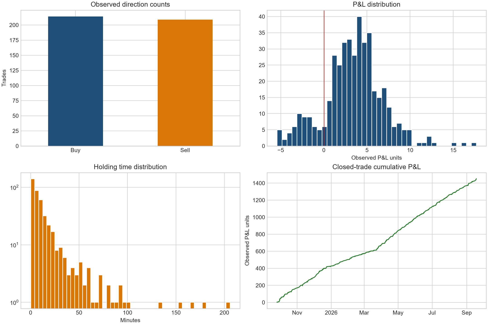
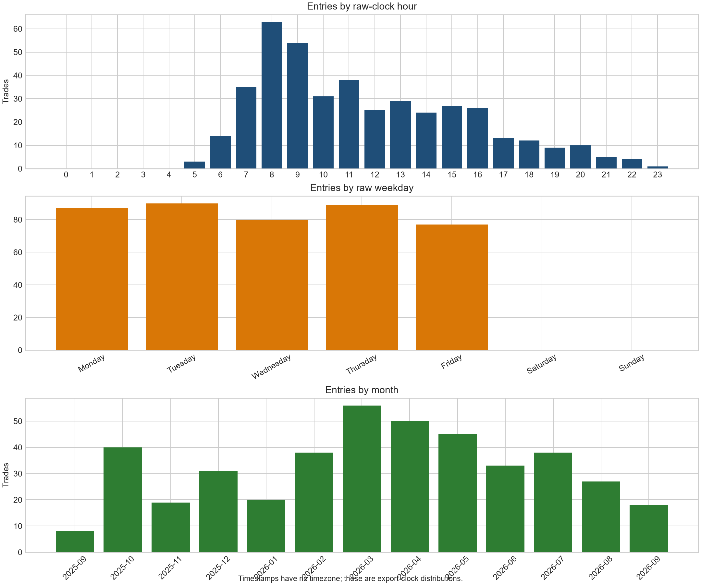
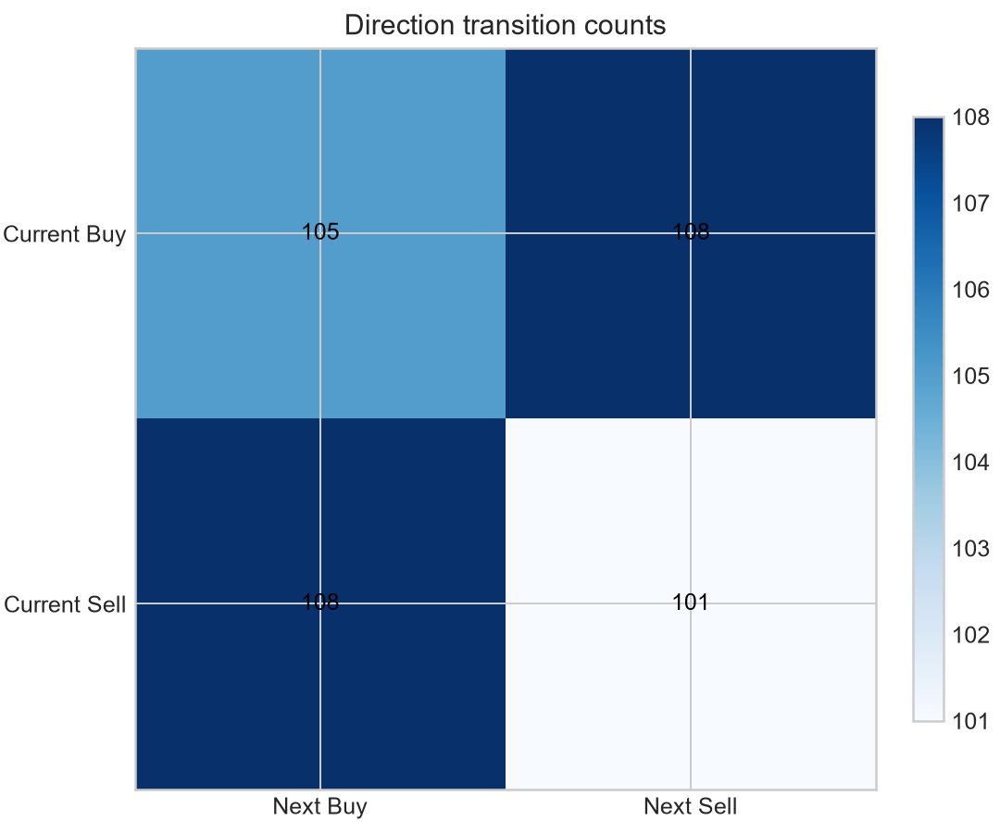
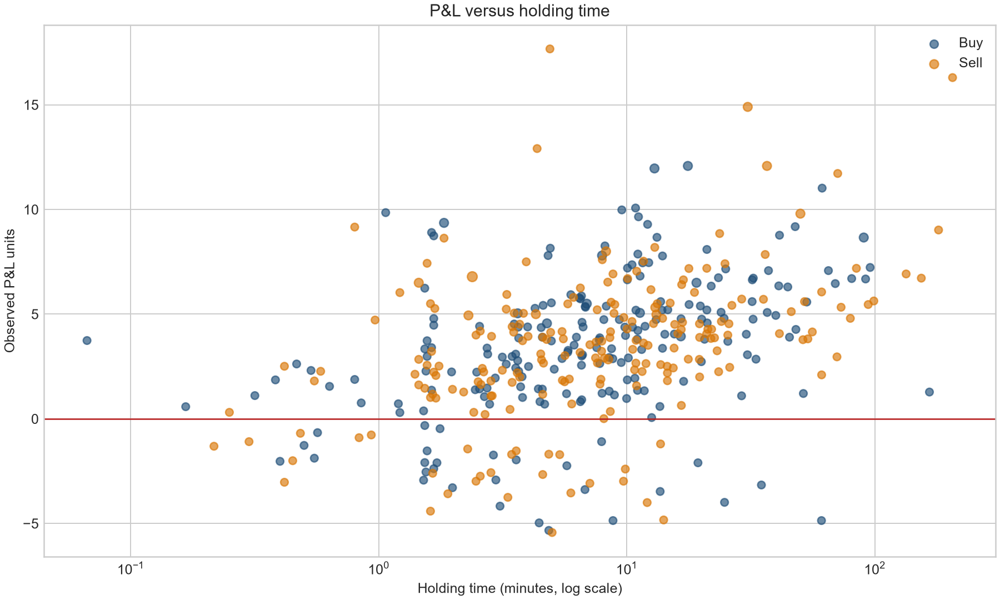

# Reverse engineering the hidden trading algorithm

## Executive conclusion

This file supports a **Level 1 behavioral fingerprint** and several cautious trade-derived subgroup findings. It does **not** identify the exact entry or exit algorithm. The strongest defensible description is a symmetric, short-horizon, mostly fixed-size gold-versus-USD trading process with episodic size changes, rare same-direction parallel entries, and a persistent outcome-conditioned holding pattern: profitable trades are held longer than losing trades. Calendar changes in holding time and raw-clock timing are real features of the exported trades, but they do not distinguish one adaptive algorithm from several algorithms or changing market conditions.

The current identification ceiling follows from the observations, not from a lack of model complexity. The TSV itself has only executed closed records. It has no synchronized broker market state, no rejected or flat decisions, no exit price, no bid/ask path, no account equity, and no broker symbol specification. Any specific RSI, EMA, breakout, trend, mean-reversion, TP, SL or trailing-stop rule would therefore be invented.

### Evidence classification

**PROVEN FROM THE FILE**

- The source has 423 rows and exactly eight tab-delimited fields per row. Its SHA-256 is `3B22B24C5F7BEB2118FFEC613640A9AB1472C3D04E4503229D00771277E4B6BD`.
- All rows carry `XAUUSD.f`; 214 are Buy and 209 are Sell.
- The apparent open interval runs from 2025-09-25T19:32:56 through 2026-09-18T06:25:04 across 359 inclusive dates and 236 active dates.
- 367 result values are positive, 56 are negative and none are zero. Their sum is 1,451.22 in unknown result/currency units.
- Size is 0.01 on 401 rows, 0.02 on 21 and 0.03 on one. Maximum observed concurrency is 2; only 3 entries occur while another interval is active.

**STRONGLY SUPPORTED AS EXECUTED-TRADE BEHAVIOR**

- Direction is almost perfectly balanced (50.59% Buy) and behaves like an IID sequence at this sample size. The IID-versus-first-order Markov likelihood-ratio test gives p=0.6251.
- Median holding time is 7.62 minutes; 74.7% close within 15 minutes and 87.7% within 30 minutes.
- Winners last longer than losses: medians 8.27 versus 2.93 minutes. The log-duration permutation p-value is 5.00e-05, and the geometric-mean ratio is 2.73x.
- That winner-longer relationship has the same sign in every primary holding-time phase: `True`.

**PLAUSIBLE, NOT IDENTIFIED**

- One core entry process with an adaptive time scale and a separate risk/size overlay.
- Quick invalidation of losing trades plus more permissive management of winners, such as trailing, signal-based or regime-scaled exits.
- A raw-clock filter or bar-timing effect. The timezone is unknown, so market sessions cannot be named.

**UNRESOLVED**

- One adaptive algorithm versus multiple independent algorithms.
- Automated versus manual origin of outliers.
- The causal reason for 0.02/0.03 sizing and the holding-time phases.

**IMPOSSIBLE TO IDENTIFY WITHOUT ADDITIONAL DATA**

- Exact indicator, price-action, event, entry, exit, TP/SL, MFE/MAE, risk-percent, spread, slippage, latency, feed and source-code rules.



## A. Data summary

| Measure | Result |
| --- | --- |
| Rows | 423 |
| Physical fields per row | 8 |
| Empty cells | 0 |
| Duplicate full rows / duplicate ticket strings | 0 / 0 |
| Apparent open range | 2025-09-25T19:32:56 to 2026-09-18T06:25:04 |
| Active dates | 236 |
| Mean trades per active date | 1.792 |
| Positive / negative active dates | 231 / 5 |
| Maximum concurrency / overlapping entries | 2 / 3 |

The export is strictly descending by close time. It has two apparent open-time inversions caused by overlapping intervals, so every sequence test first sorts by open time and ticket. The literal ticket `00983845` is preserved as text. It is a format/data-quality anomaly and is not silently repaired. Price display precision varies from zero to three decimal places, so tick size cannot be inferred from formatting.

### Field dictionary

| Position | Working name | Observed structure | Certainty | Limitation |
| --- | --- | --- | --- | --- |
| 1 | ticket | Text identifier | Observed | Order/deal/position/ticket semantics unknown; preserve leading zero. |
| 2 | side | Buy or Sell | Observed | Direction label. |
| 3 | open_time | Interval start / apparent open | Structurally inferred | Naive second-resolution timestamp; timezone unknown. |
| 4 | close_time | Interval end / apparent close | Structurally inferred | Always later than field 3; timezone unknown. |
| 5 | symbol | XAUUSD.f | Observed | Exact broker contract and suffix semantics unknown. |
| 6 | lot_size | Size-like decimal | Apparent | Likely lots; broker unit/contract value unknown. |
| 7 | observed_price | Price-like decimal | Unknown semantics | Could be entry, exit, average, or another price. |
| 8 | pnl | Signed result | Apparent | Currency and inclusion of commission/swap/fees unknown. |

## B. Instrument identification

`XAUUSD.f` is, with high confidence, a broker-defined gold-versus-US-dollar symbol. The official ISO 4217 list identifies XAU as gold and USD as the US dollar, and CME classifies XAU/USD under spot precious metals. MetaTrader documents that symbol names, digits, contract size, spread and related specifications are broker-set. The `.f` suffix is therefore not evidence that this is a futures contract. An exact Pepperstone specification uses `XAUUSD.f` for “Spot Gold $”, but that is only a lead and does not establish this account's broker.

The exact legal wrapper, contract size, quote basis, tick value, trading hours, financing, profit currency and server timezone remain unresolved. Sources: [SIX ISO 4217 List One](https://www.six-group.com/dam/download/financial-information/data-center/iso-currrency/lists/list-one.xml), [CME FX Product Guide](https://www.cmegroup.com/markets/fx/fx-product-guide.html), [MetaTrader 5 symbol specifications](https://www.metatrader5.com/en/terminal/help/trading/market_watch), and the [broker-specific XAUUSD.f example](https://files.pepperstone.com/legal/CYSEC/Pepperstone-Specificites-du-Compte-Risque-Limite.pdf).

Observed price-like values range from 3,736.130 to 5,412.010. The column is compatible with an entry/average execution price, including near-identical prices in overlapping pairs, but the TSV cannot prove its semantics.

## C. Timeline

- First apparent open: 2025-09-25T19:32:56.
- Last apparent open: 2026-09-18T06:25:04.
- Last supplied interval closes shortly after the last open; every supplied row opens and closes on the same calendar date.
- Calendar span: 359 inclusive dates, with 236 active dates.
- Busiest month in the supplied interval: 2026-03 with 56 trades.

## D. Trading behavior

The raw-clock entry distribution is concentrated around hours 06–16. Hour 08 contains 63 entries. The 24-bin uniform reference is rejected (p=8.72e-73); the five-minute-bin minute-of-hour reference is also non-uniform (p=0.0017). These tests describe `P(raw clock | observed trade)`. They do not estimate `P(trade | raw clock)` because eligible no-trade times and the server timezone are absent. Weekday counts are compatible with a uniform Monday–Friday reference (p=0.8134).

There are 3 overlap pairs. All are same direction and none is a hedge. They occur early in the sample and look like rare parallel entries or scale-ins, but deal/order lineage is needed to distinguish those explanations.

| Prior ticket | New ticket | Side pair | Entry delta (sec) | Common overlap (sec) | Sizes |
| --- | --- | --- | --- | --- | --- |
| 36168589 | 36168590 | Buy/Buy | 5 | 368 | 0.01/0.01 |
| 36227385 | 36227388 | Sell/Sell | 5 | 68 | 0.01/0.03 |
| 36335183 | 36335196 | Buy/Buy | 29 | 477 | 0.01/0.01 |

The observed number of same-day gaps at or below 30 minutes is 29. An IID null that preserves each day's count and the global raw-clock distribution has mean 21.35 and p=0.0542. This is borderline, not strong evidence of event bursts, and the actual opportunity window is still unknown.



## E. Statistical fingerprint

### Direction and sequence

| Metric | Result |
| --- | --- |
| Buy / Sell | 214 / 209 |
| Buy share (95% Wilson CI) | 50.59% (45.84%–55.33%) |
| Direction entropy | 0.9999 bits |
| Same-direction transition rate | 48.82% |
| Runs-test p-value | 0.6592 |
| IID vs first-order Markov p-value | 0.6251 |
| First- vs second-order Markov p-value | 0.3420 |

The chronological transition counts are Buy→Buy 105, Buy→Sell 108, Sell→Buy 108 and Sell→Sell 101. BIC favors the IID direction model over first- and second-order Markov alternatives. There is no trade-only evidence for directional persistence.



### P&L-like result

| Metric | Result |
| --- | --- |
| Positive / negative / zero | 367 / 56 / 0 |
| Positive share, Wilson 95% CI | 86.76% (83.20%–89.66%) |
| Positive share, day-cluster bootstrap 95% CI | 84.04%–89.56% |
| Total / mean / median | 1,451.22 / 3.431 / 3.710 |
| Mean day-cluster bootstrap 95% CI | 3.110–3.776 |
| Minimum / maximum | -5.43 / 17.67 |
| Average positive / average negative | 4.348 / -2.577 |
| Payoff ratio / profit factor | 1.687 / 11.055 |
| Longest positive / negative run | 19 / 2 |
| Closed-trade cumulative max drawdown | 5.43 |

The drawdown above is calculated only from chronologically accumulated closed-row results. It is not account-equity drawdown and excludes open-position marks, fees if absent from the result field, deposits, withdrawals and other symbols. Buy and Sell means are almost identical after normalizing every result to a 0.01 size: 3.239 versus 3.235, permutation p=0.9893.

### Holding time and exit fingerprint

| Metric | Result |
| --- | --- |
| Mean / median | 15.00 / 7.62 minutes |
| 25th / 75th percentile | 3.12 / 15.46 minutes |
| 90th / 95th / 99th percentile | 35.43 / 60.45 / 126.11 minutes |
| Maximum | 205.78 minutes |
| Winner / loser median | 8.27 / 2.93 minutes |
| Duration vs size-normalized result Spearman rho | 0.450 (p=1.58e-22) |
| Exact whole-minute holds observed / expected | 7 / 7.05 (p=1.0000) |
| Largest exact-second duration repeat count | 5 |

The absence of excess whole-minute durations and the weak exact-second modes argue against a rigid whole-minute time stop. A lognormal is the best of the tested single positive-duration distributions by BIC, but no fitted distribution proves an exit rule. The longer-winner/shorter-loser pattern is consistent with quick invalidation plus winner extension; it does not distinguish trailing, signal reversal, volatility scaling or structure-based exits.



### Position size

Above-base size occurs on 22 rows (5.20%). Direction is unrelated to above-base size (Fisher p=1.0000). Neither the previous trade's result nor the previous five-trade result separates the size groups (p=0.9421 and 0.3520). After normalizing result to 0.01, large-minus-base performance is 0.406 with p=0.5738. All 22 above-base rows are positive, but the exchangeable-outcome probability is 0.0403 before broad search correction.

Size is time-clustered: the registered one-change scan remains significant under block permutation and FDR. This is evidence of an episodic size regime, not evidence for a second entry algorithm. Account equity is absent, so fixed-fraction or balance-step sizing cannot be tested.

## F. One-vs-multiple-system analysis

| Hypothesis | Evidence for | Evidence against / missing | Current status |
| --- | --- | --- | --- |
| H0: one adaptive strategy | Symmetric sides; IID directions; winner-longer exit pattern persists across holding phases | Behavior is nonstationary in duration, raw clock and size | Plausible; not proven |
| H1: two strategies | Mixture/HMM likelihood improves with more components/states | Low silhouette; state count is at/near search boundary; market regimes can create the same components | Weak and unresolved |
| H2: three or more strategies | BIC selects a multi-state descriptive model | No component has a source label; selection keeps improving with flexibility | Weak and unresolved |
| H3: automation plus manual intervention | A few multivariate outliers exist | No manual/EA reason codes; anomalies have many alternative explanations | Unsupported |
| H4: core strategy plus risk/execution module | Base size dominates; larger size is episodic; rare same-side parallel entries | Equity, margin, signal strength and order lineage are absent | Plausible |

The GMM BIC minimum among the registered search is 4,718.9 at 6 components; the mean seed-to-seed adjusted Rand stability is 0.880. The HMM BIC minimum is 5,020.9 at 5 states. Both models summarize raw clock, log duration, size-normalized result and log entry gap. They deliberately exclude side and lot from the fitting features. Even so, low silhouettes and boundary-seeking state counts show non-Gaussian heterogeneity more clearly than a uniquely identified number of source algorithms.

Holding-time recursive scans identify 5 descriptive phases, with a 36.3% reduction in log-duration RSS and segmented-minus-single BIC of -142.2. The boundaries are model-dependent and can result from volatility changes under one fixed exit rule.

| Phase | Dates | Trades | Median minutes | Winner median | Loser median |
| --- | --- | --- | --- | --- | --- |
| 1 | 2025-09-25 to 2025-11-05 | 51 | 5.48 | 5.68 | 3.58 |
| 2 | 2025-11-06 to 2026-01-26 | 65 | 24.00 | 24.88 | 11.22 |
| 3 | 2026-01-28 to 2026-04-10 | 114 | 2.66 | 2.83 | 1.52 |
| 4 | 2026-04-10 to 2026-07-07 | 117 | 8.08 | 9.19 | 2.57 |
| 5 | 2026-07-07 to 2026-09-18 | 76 | 12.02 | 12.27 | 4.85 |

## G. Candidate strategy families

| Candidate | In-sample fit | Out-of-sample fit | Complexity | Stability | Evidence |
| --- | --- | --- | --- | --- | --- |
| Short-horizon, mostly fixed-size trading process | High descriptive fit to duration/size | Behavioral stability only | Low | Report sensitivity tables | Supported as behavior, not entry family |
| Raw-clock/session filter | Timing concentration can be measured | Cannot map to sessions without timezone | Low | Clock bucket stability | Plausible only |
| One adaptive strategy | Compare BIC/HMM/changepoints | No market-state replication | Moderate | Mixture seed and penalty sensitivity | Unresolved |
| Multiple independent strategies | Compare BIC/HMM/changepoints | No source labels or market replay | Moderate | Mixture seed and penalty sensitivity | Unresolved |
| Trend or momentum entry | No direct fit possible | Blocked | Unknown | Requires OHLC/ticks | Unsupported |
| Mean-reversion entry | No direct fit possible | Blocked | Unknown | Requires OHLC/ticks | Unsupported |
| Breakout/price-action entry | No direct fit possible | Blocked | Unknown | Requires OHLC/ticks | Unsupported |
| Fixed TP/SL, trailing, signal or volatility exit | No direct fit possible | Blocked | Unknown | Requires exit price and path | Unsupported |

Trend, momentum, mean-reversion, breakout, price-action, volatility and event-driven families cannot be ranked from trade outcomes alone. The observed payoff and holding asymmetry does not support the stereotyped “many small wins and rare large losses” version of fixed-target mean reversion, but that is not a family-level rejection.

## H. Research review

The most transferable methods are system identification with explicit observational equivalence, change-point testing, finite mixtures/HMMs, chronological validation, block/bootstrap uncertainty, FDR/data-snooping controls, and interpretable rule discovery after a no-trade panel exists. Inverse reinforcement learning is premature because the state space, available actions and transitions are not observed, and reward functions are non-identifiable even with much richer demonstrations.

Closest direct precedents include [Hayes, Beling & Scherer on reverse engineering trading strategies](https://doi.org/10.1007/s10669-013-9458-1), [Yang et al. on Gaussian-process trading-strategy identification](https://doi.org/10.1080/14697688.2015.1011684), and [Sueshige et al. on identifying forex strategy ecology](https://doi.org/10.1371/journal.pone.0208332). Those projects use market states, complete action streams or order-book data that this TSV lacks.

| ID | Citation | Method | Transfer to this project | Main failure modes |
| --- | --- | --- | --- | --- |
| R01 | Bellman & Åström (1970), On Structural Identifiability | Structural identifiability of input-output systems | Formal basis for the mandatory identifiability limitation | Finite and incomplete observations admit non-unique internal models |
| R02 | Ljung, System Identification: Theory for the User | Black-box system identification and validation | Frames the account as an input-output system and requires validation | Misspecification, unmeasured inputs, poor excitation |
| R03 | Killick, Fearnhead & Eckley (2012), PELT | Penalized optimal multiple changepoints | Implemented on standardized observed trade features with sensitivity checks | Penalty/cost sensitivity; a break is not a new algorithm |
| R04 | Page (1954), Continuous Inspection Schemes | CUSUM sequential change monitoring | Useful for future live monitoring after a stable baseline exists | Requires a prespecified baseline and shift; serial dependence matters |
| R05 | Rabiner (1989), HMM tutorial | Hidden Markov state inference | Implemented as exploratory latent behavioral states, not source labels | Local optima, emission misspecification, label switching, small samples |
| R06 | Hamilton (1989), Markov switching | Persistent latent regimes in time series | Supports distinguishing persistent adaptation from static mixtures | Regime labels need economic interpretation; model form can create states |
| R07 | Teicher (1963), Identifiability of Finite Mixtures | Conditions for mixture identifiability | Guards against calling GMM components separate EAs | A fitted component is not automatically a real generator; distributional assumptions matter |
| R08 | Rissanen (1978), Modeling by shortest data description | Minimum description length | Use mismatch plus explicit rule/state complexity when market data arrives | Encoding choice and search universe affect complexity penalty |
| R09 | Schwarz (1978), Estimating the Dimension of a Model | Bayesian information criterion | Used to compare GMM/HMM state counts on one observation definition | Asymptotic/regularity assumptions; incomparable likelihood definitions |
| R10 | Benjamini & Hochberg (1995) | False-discovery-rate control | Implemented across the registered trade-only tests | Dependence conditions; FDR is not zero false discoveries |
| R11 | White (2000), A Reality Check for Data Snooping | Bootstrap correction over a searched model universe | Required after large indicator/rule search; not applicable before market data | Fails if attempted rules are not logged or dependence is broken |
| R12 | Efron (1979), Bootstrap Methods | Non-parametric sampling uncertainty | Used for descriptive CIs, supplemented with whole-day cluster resampling | IID resampling breaks dependence |

The full 26-source method/data/failure-mode matrix is in [`research/source_matrix.tsv`](../../research/source_matrix.tsv).

## I. Entry reconstruction

No entry rule is identified. What can be said is narrower:

- The executed direction sequence is balanced and statistically compatible with IID.
- Side does not materially change result, win fraction, holding time or above-base size.
- Entries concentrate in raw-clock windows and minute-of-hour bins, but timezone and opportunity exposure are missing.
- Three early overlap pairs are same-side and near-simultaneous, consistent with a shared signal or execution split.

To reconstruct entries, create a timestamped opportunity panel with Buy, Sell and NoTrade labels using the exact broker feed. Fit interpretable logistic models and shallow trees first; record incremental likelihood/AIC/BIC, permutation importance and time-ordered holdout results. Symbolic/program search should start only after the feature grammar and untouched test periods are frozen.

## J. Exit reconstruction

The file supports an outcome-conditioned duration fingerprint, not an exit mechanism. Fixed whole-minute timing is unsupported. Exact fixed TP/SL, trailing stops, signal reversal, volatility scaling and structure exits require the exit price plus the bid/ask path from open through close. MFE, MAE, exit-to-MFE ratio and ATR-scaled distances are therefore unavailable.

The defensible candidate is a generic rule class:

1. Close invalidated/losing positions relatively quickly.
2. Permit favorable positions to remain open longer.
3. Allow the overall time scale to vary by calendar/market regime.

This class is observationally compatible with several distinct implementations and is not source-code reconstruction.

## K. Risk reconstruction

The base observed size is 0.01. Larger sizes are episodic rather than a smooth monotone function of closed cumulative result. That weakens a simple equity-growth-step explanation, but equity and margin are absent. The single 0.03 row participates in a parallel same-direction pair, which is compatible with a one-off scale-in or execution split. Exact risk percent, stop-distance sizing, martingale/anti-martingale behavior and exposure caps remain unknown.

## L. Market-state analysis

An exploratory comparison against a Dukascopy bid-only M1 reference feed is present in this project. It requires an assumed UTC+3 timestamp shift and matches every record to a nearby bar, but this does not verify the broker feed, server timezone, bid/ask execution or the price-field semantics. More importantly, its five chronological entry-detection folds have mean ROC AUC 0.511, mean precision 0.0000 and mean lift 0.00x. The shallow reference-feed models predicted no test entries. Therefore that experiment provides no evidence for a breakout, indicator or other entry family, and it does not loosen the identification limit.

The optional market module calculates returns, EMA, RSI, MACD, ATR, Bollinger z-score, stochastic, recent-high/low distances, wick/body features, volatility, VWAP where volume exists, entry alignment and reference-feed price-path excursions. Its output must stay exploratory until broker-specific bid/ask data and verified time semantics are supplied. See [`market_reconstruction_report.md`](../market_reconstruction/market_reconstruction_report.md).

## M. Model-selection evidence

| Model | Order | AIC | BIC | Minimum state/component size |
| --- | --- | --- | --- | --- |
| GMM | 1 | 6,022.1 | 6,062.6 | 423 |
| GMM | 2 | 5,524.5 | 5,609.5 | 162 |
| GMM | 3 | 4,947.3 | 5,076.8 | 120 |
| GMM | 4 | 4,864.9 | 5,038.9 | 53 |
| GMM | 5 | 4,592.8 | 4,811.4 | 49 |
| GMM | 6 | 4,455.8 | 4,718.9 | 20 |
| Gaussian HMM | 1 | 6,022.1 | 6,062.6 | 423 |
| Gaussian HMM | 2 | 5,720.1 | 5,813.2 | 144 |
| Gaussian HMM | 3 | 4,917.8 | 5,071.6 | 119 |
| Gaussian HMM | 4 | 4,824.9 | 5,047.5 | 55 |
| Gaussian HMM | 5 | 4,721.4 | 5,020.9 | 46 |
| Gaussian HMM | 6 | 4,664.4 | 5,048.9 | 40 |

The direction model comparison favors IID. The latent-feature models favor several descriptive components/states, but their state-count evidence is not a count of algorithms. The registered block-permutation one-change scan retains FDR-significant changes in lot size and raw-clock circular position; size-normalized P&L, win fraction and direction do not have an FDR-significant single change.

| Feature | Split time | Before | After | Block p | FDR q |
| --- | --- | --- | --- | --- | --- |
| lot_size | 2025-12-08T16:57:55 | 0.012 | 0.010 | 0.0005 | 0.0020 |
| raw_hour_sine | 2026-07-03T06:32:03 | 0.009 | 0.366 | 0.0015 | 0.0040 |
| raw_hour_cosine | 2026-03-31T20:13:28 | -0.677 | -0.459 | 0.0005 | 0.0020 |

## N. Out-of-sample testing

True strategy walk-forward validation remains blocked because an exact broker market state and an authenticated no-trade opportunity set are absent. The exploratory non-broker reference-feed test also fails to predict entries; it is evidence against adopting its fitted trees, not a reconstruction. A limited expanding-month behavioral stability test uses the first three months as the initial training window and advances one month at a time. Across 10 folds, mean absolute errors are 7.7% for Buy share, 4.6% for positive-result share, 0.830 result units for mean P&L and 5.81 minutes for median duration. This measures stability of summaries, not signal replication.

## O. Null-model testing

- Direction-label permutation shows no unusual adjacent persistence.
- Raw-clock bucket versus direction permutation is not significant (p=0.2420).
- The empirical-clock IID burst null is borderline (p=0.0542).
- Buy/Sell raw and size-normalized result differences are null.
- Change-point scans use both IID and contiguous-block permutations; FDR uses the more conservative block p-values.
- The full test universe and BH/Bonferroni results are in [`tables/statistical_tests.csv`](tables/statistical_tests.csv).

## P. Robustness testing

- Bootstrap intervals are shown both at row level and by resampling whole active dates.
- P&L comparisons are repeated after normalizing for 0.01 size.
- Direction is checked by runs, permutation, likelihood-ratio, AIC and BIC methods.
- GMM stability is tested across seeds; PELT is tested across penalty multipliers; one-change scans use block permutation.
- Holding-time phase interpretation is checked against outcome behavior. Winners remain longer in every primary phase.
- Multiple-testing control is applied to the registered trade-only tests. 11 tests remain significant at 5% BH FDR, but exposure-invalid timing references are not promoted to causal claims.

## Q. Reconstructed pseudocode

This is the maximum defensible reconstruction. `UNKNOWN` is deliberate.

```text
INPUTS
    broker market state = UNKNOWN
    account/equity state = UNKNOWN
    server timezone = UNKNOWN

MARKET FILTER
    UNKNOWN: trend / momentum / mean reversion / breakout / event logic

RAW-CLOCK FILTER
    behavior is concentrated in recurring clock windows
    exact named session = UNKNOWN until timezone is known

DIRECTION
    choose Buy or Sell by UNKNOWN market-state rule
    aggregate output is approximately symmetric and IID

POSITION SIZE
    default observed size = 0.01
    occasionally use 0.02; once use 0.03
    cause = UNKNOWN episodic risk/signal/execution condition

ENTRY
    enter one position
    rarely add a near-simultaneous same-direction position

EXIT
    if trade becomes unfavorable, it tends to close sooner
    if favorable, it tends to remain open longer
    calendar/market conditions alter the typical holding-time scale
    exact stop / target / trailing / reversal rule = UNKNOWN

RE-ENTRY
    short close-to-next-entry gaps occur, without strong direction persistence
```

## R. Confidence table

| Component | Reconstruction | Confidence |
| --- | --- | --- |
| Direction logic | Near-balanced observed Buy/Sell sequence; exact rule unknown | Weak |
| Entry | Not reconstructable without synchronized market/no-trade data | Unsupported |
| Exit | Short observed holds; exit mechanism unknown | Weak |
| Position size | 0.01 base with 22 larger observations; causal rule unknown | Moderate descriptively |
| Session filter | Raw-clock concentration only; timezone unknown | Weak |
| Risk control | Trade-level P&L visible; equity, SL/TP and account risk absent | Unsupported |
| Re-entry | Can quantify close-to-next-open gaps and direction | Moderate descriptively |
| One versus multiple systems | Trade-attribute mixture/state evidence only | Weak |

## S. What remains unknown

### Formal identifiability limitation

Let the observed trade sequence be

`T = F(M, A, E, θ)`,

where `M` is market history, `A` is account/risk state, `E` is execution/broker behavior and `θ` is the hidden strategy. In this file, most of `M`, `A` and `E` are unobserved. Even if they were known for the finite sample, different systems can satisfy

`F₁(M, A, E, θ₁) = F₂(M, A, E, θ₂) = T`.

Therefore a finite fitted rule does not prove source identity. The current result distinguishes exact file facts, statistical evidence, observational equivalence, plausible reconstruction and unsupported speculation. This follows the structural-identifiability literature ([Bellman & Åström](https://doi.org/10.1016/0025-5564(70)90132-X)) and the explicit non-identifiability results in inverse reinforcement learning ([Cao, Cohen & Szpruch](https://papers.nips.cc/paper/2021/hash/671f0311e2754fcdd37f70a8550379bc-Abstract.html)).

Unknown items include field-7 semantics; result currency and cost treatment; broker/server/timezone; contract size/tick value; entry and exit bid/ask; exact exit price; pending/rejected/cancelled orders; partial fills; magic/comment/EA identifiers; account equity; other positions; true opportunity set; and every market-state indicator at decision time.

## T. Additional data required

Highest priority:

1. Original MT4/MT5 statement plus raw deal, order and position history with stable IDs, comments, magic numbers and reason codes.
2. Broker/server name, server timezone and the complete `XAUUSD.f` Symbol Specification.
3. Entry and exit requested/executed bid/ask prices, spread, commission, swap, SL/TP and all modifications, partial fills, rejects and cancels.
4. Account balance/equity/margin history and all simultaneous positions.
5. Broker-specific ticks over the entire sample; if unavailable, broker-specific 1-minute bid/ask OHLC with spread and volume.
6. Versioned economic-release timestamps for any event-driven hypothesis.

The exact machine-readable schemas and rerun guidance are in [`docs/data_requirements.md`](../../docs/data_requirements.md).

## Reproducibility and audit artifacts

- [`analysis_metrics.json`](analysis_metrics.json): machine-readable headline results.
- [`tables/experiment_tracker.csv`](tables/experiment_tracker.csv): hypothesis register.
- [`tables/proof_log.csv`](tables/proof_log.csv): claim/evidence/test/assumption/alternative/confidence log.
- [`tables/specification_coverage.csv`](tables/specification_coverage.csv): section-by-section brief coverage.
- [`tables/anomaly_review.csv`](tables/anomaly_review.csv): statistically unusual rows, never labeled manual.
- [`tables/walk_forward_behavior.csv`](tables/walk_forward_behavior.csv): expanding-month behavior checks.
- [`tables/holding_time_recursive_scans.csv`](tables/holding_time_recursive_scans.csv): recursive holding-time scans and p-values.
- [`tables/holding_time_phases.csv`](tables/holding_time_phases.csv): primary duration phases.
- [`research/source_matrix.tsv`](../../research/source_matrix.tsv): research/data-requirement matrix.

All outputs derive from the preserved raw file and deterministic random seeds. See the project README for the rerun command.
